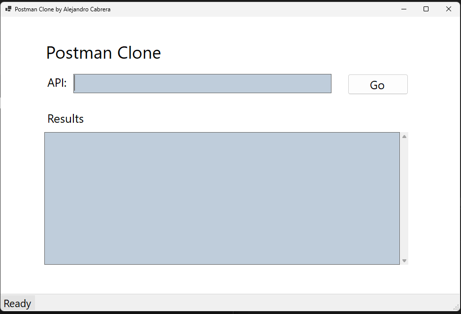
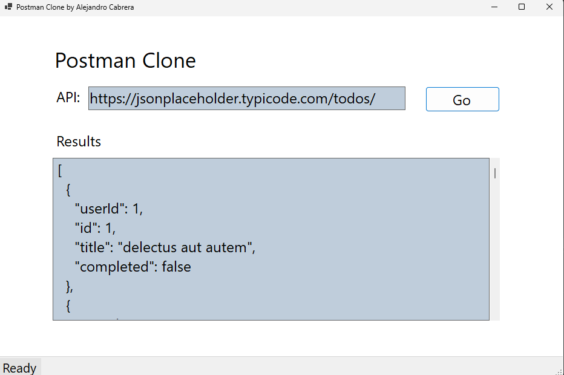

# Postman Clone App

The original Postman app "is an API platform for building and using APIs. Postman simplifies each step of the API lifecycle and streamlines collaboration so you can create better APIs—faster." You can find more about it here: https://www.postman.com/company/about-postman/

This app is an inspired clone of the original Postman app, which was created for learning purposes, but at the same time is also functional by also being able to create GET, POST, PUT/PATCH and DELETE calls. It was created by using two main components, a C# libary (which implements HttpClient libray) called "Postman Clone Library" and a Windows Form App component which is used to comunitcate with the C# libray but also displays visual UI data.

## Technologies Used:
* C#
* .NET 8
* WinForms
* HttpClient

## Using The Postman Clone App:
1. Download the executable file from the release section.
2. When the application runs, the application should look like the image below:

3. Paste in your API URL in the text box and then press the "Go" button.
4. You should see a JSON text result in the "Results" text box if your call was successful, if not an error message will appear.

